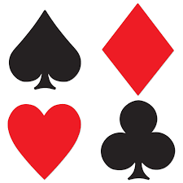

 

  

  <h3 align="center">Cards - 24</h3>

  

    A chill game that will kill your bordem in no time!
  

   
    &middot;
    <a href="https://github.com/CharlieGonzo/Card-Game/issues/new?labels=bug&template=bug-report---.md">Report Bug</a>
    &middot;
    <a href="https://github.com/CharlieGonzo/Card-Game/issues/new?labels=enhancement&template=feature-request---.md">Request Feature</a>
  

